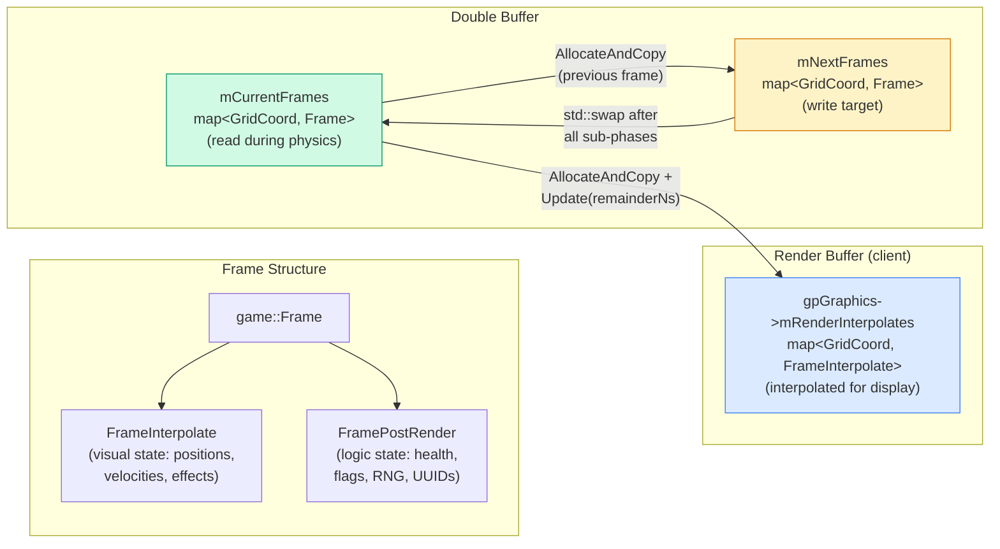
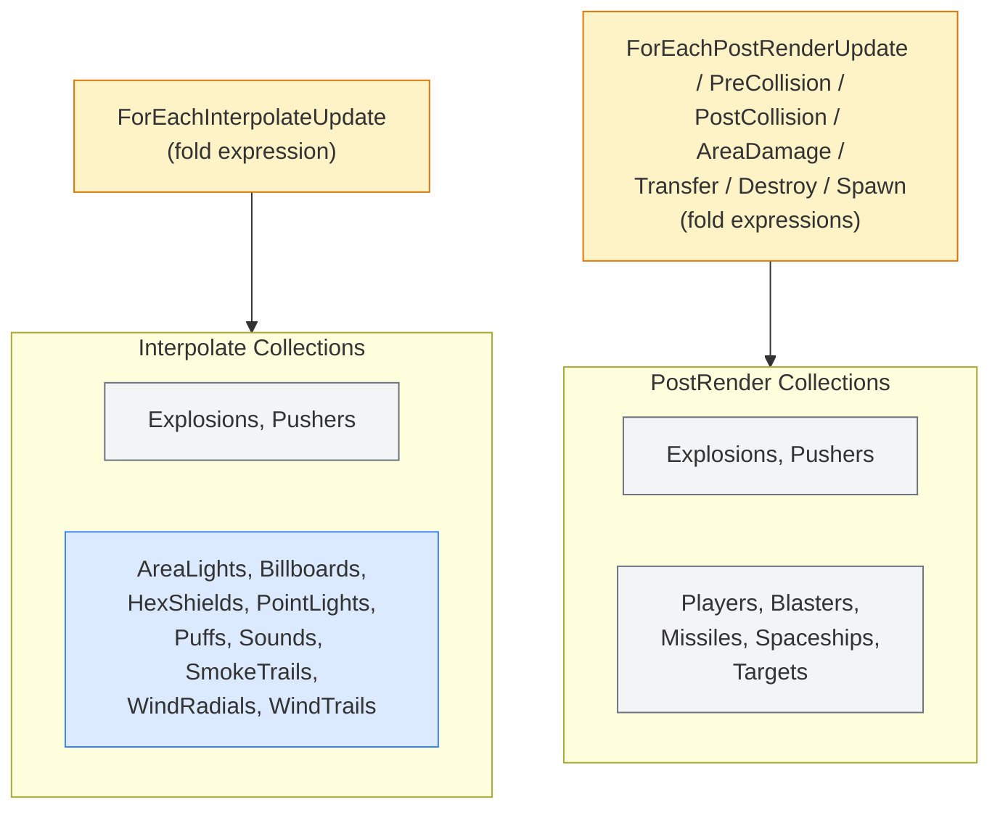

# Architecture: Frame Update Pipeline

> Auto-generated by `/generate-architecture-diagram` from `Engine/Source/Frame/` and `Engine/Source/Main.cpp`

## Two-Phase Update Pipeline

```mermaid
%%{init: {'theme': 'default'}}%%
flowchart LR
    classDef interpolate fill:#dbeafe,stroke:#3b82f6
    classDef postrender fill:#fef3c7,stroke:#d97706
    classDef collision fill:#fee2e2,stroke:#ef4444
    classDef lifecycle fill:#d1fae5,stroke:#059669

    subgraph Interpolate ["Phase 1: Interpolate"]
        i_alloc["AllocateAndCopy"]:::interpolate
        i_update["Update<br/>(smooth positions)"]:::interpolate
    end

    subgraph PostRender ["Phase 2: PostRender (7 sub-phases)"]
        pr_alloc["AllocateAndCopy"]:::postrender
        pr_update["1. Update<br/>(input, state)"]:::postrender
        pr_precol["2. PreCollision<br/>(register layers)"]:::collision
        pr_postcol["3. PostCollision<br/>(query results)"]:::collision
        pr_area["4. AreaDamage<br/>(explosion falloff)"]:::collision
        pr_transfer["5. Transfer<br/>(cross-cell moves)"]:::lifecycle
        pr_destroy["6. Destroy<br/>(remove expired)"]:::lifecycle
        pr_spawn["7. Spawn<br/>(create entities)"]:::lifecycle
    end

    swap["std::swap<br/>(mCurrentFrames,<br/>mNextFrames)"]

    i_alloc --> i_update
    i_update --> pr_alloc
    pr_alloc --> pr_update --> pr_precol --> pr_postcol --> pr_area --> pr_transfer --> pr_destroy --> pr_spawn --> swap
```

## Client Main Loop

```mermaid
%%{init: {'theme': 'default'}}%%
flowchart TD
    classDef input fill:#e0f2fe,stroke:#0284c7
    classDef physics fill:#fef3c7,stroke:#d97706
    classDef network fill:#fee2e2,stroke:#ef4444
    classDef render fill:#d1fae5,stroke:#059669

    start(["Main Loop Start"])

    msgs["ProcessMessages()"]:::input
    input["RawInputManager::Update()"]:::input

    reconcile["WaitForReconcile()<br/>ApplyReconcileResult()"]:::network

    preupdate["PreUpdate(menuInput)"]:::physics

    subgraph physics_loop ["Fixed Timestep Loop (64 Hz, 15.625ms)"]
        ts["TimeStep::UpdateRealtime()<br/>-> iFullUpdates"]:::physics
        interpolate["FrameInterpolate::<br/>AllocateAndCopy + Update"]:::physics
        postrender["FramePostRender::<br/>7 sub-phases"]:::physics
        frame_swap["std::swap(current, next)"]:::physics
        ts --> interpolate --> postrender --> frame_swap
    end

    net_poll["PollNetworkClient()"]:::network
    kick["TryKickReconcile()"]:::network
    send["NetworkClient::SendAck()<br/>NetworkClient::Flush()"]:::network

    subgraph render_phase ["Render (variable rate)"]
        r_interp["FrameInterpolate::<br/>AllocateAndCopy + Update<br/>(render interpolation)"]:::render
        r_begin["BeginRender()"]:::render
        r_main["Render()<br/>(lights, collections,<br/>smoke, wind)"]:::render
        r_end["EndRender()"]:::render
        r_interp --> r_begin --> r_main --> r_end
    end

    audio["AudioManager::Update()"]:::render

    start --> msgs --> input --> reconcile --> preupdate --> physics_loop
    physics_loop --> net_poll --> kick --> send --> render_phase --> audio
    audio -->|next frame| start
```

## Server Main Loop

```mermaid
%%{init: {'theme': 'default'}}%%
flowchart TD
    classDef physics fill:#fef3c7,stroke:#d97706
    classDef network fill:#fee2e2,stroke:#ef4444
    classDef server fill:#f3e8ff,stroke:#9333ea

    start(["Server Loop Start"])

    msgs["ProcessMessages()"]:::server
    sleep["Sleep (waitable timer)<br/>until next tick"]:::server

    net_recv["NetworkServer::Poll()<br/>DiscoveryResponder::Poll()"]:::network
    disconnects["HandleDisconnectsServer()"]:::network
    new_clients["HandleNewClientsServer()"]:::network
    spawns["ProcessSpawnRequestsServer()"]:::network

    subgraph physics_loop ["Fixed Timestep Loop (64 Hz)"]
        ts["TimeStep::UpdateRealtime()"]:::physics
        interpolate["FrameInterpolate::<br/>AllocateAndCopy + Update"]:::physics
        postrender["FramePostRender::<br/>7 sub-phases"]:::physics
        frame_swap["std::swap(current, next)"]:::physics
        finalize["FinalizeNewClientsServer()"]:::network
        deaths["DetectPlayerDeathsServer()"]:::network
        broadcast["BroadcastStatusChangesServer()<br/>BufferFrame + SendUpdate +<br/>SendResends + Flush"]:::network
        subscriptions["HandleSubscriptionUpdatesServer()"]:::network
        ts --> interpolate --> postrender --> frame_swap
        frame_swap --> finalize --> deaths --> broadcast --> subscriptions
    end

    display["UpdateServerDisplayStats()<br/>InvalidateRect (GDI)"]:::server

    start --> msgs --> sleep --> net_recv --> disconnects --> new_clients --> spawns --> physics_loop --> display
    display -->|next frame| start
```

## Dual-Buffered Frame Lifecycle



## Collection Phase Participation


