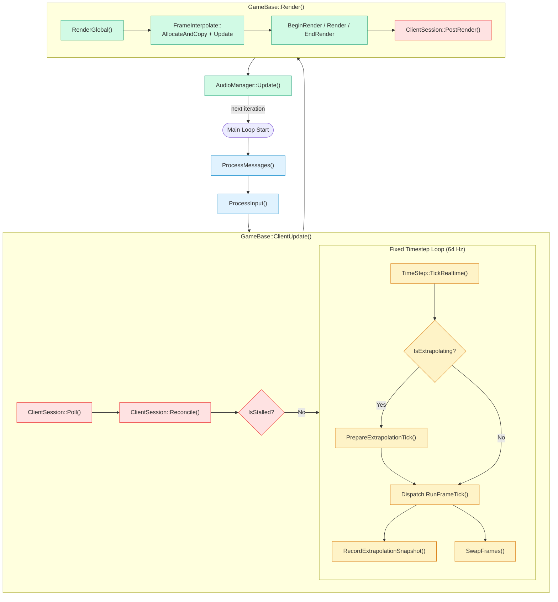
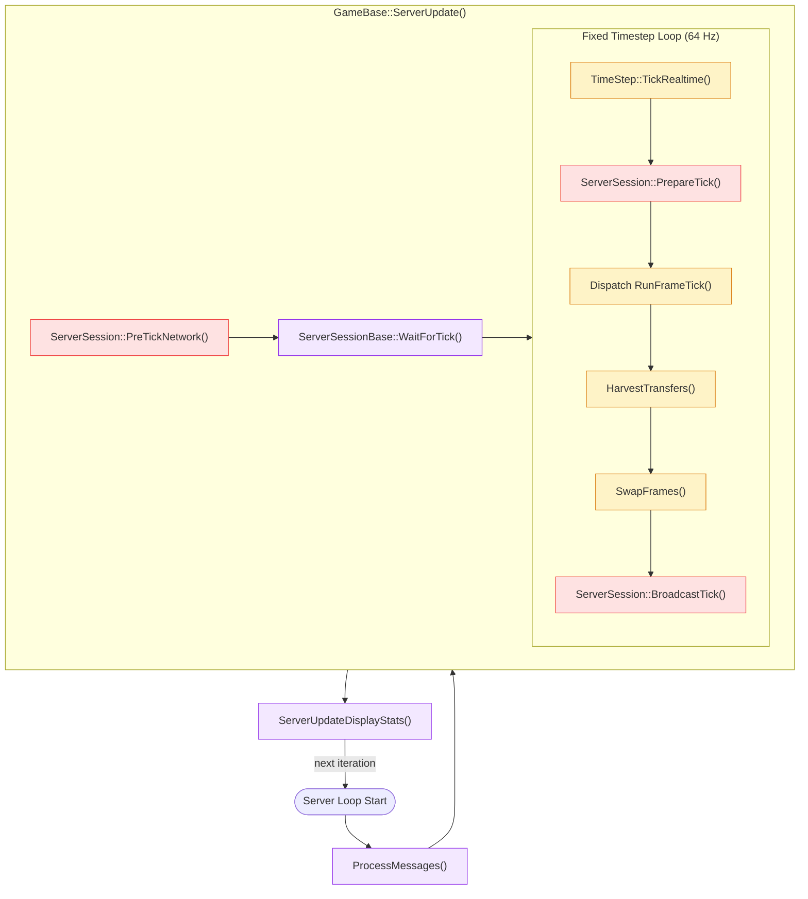
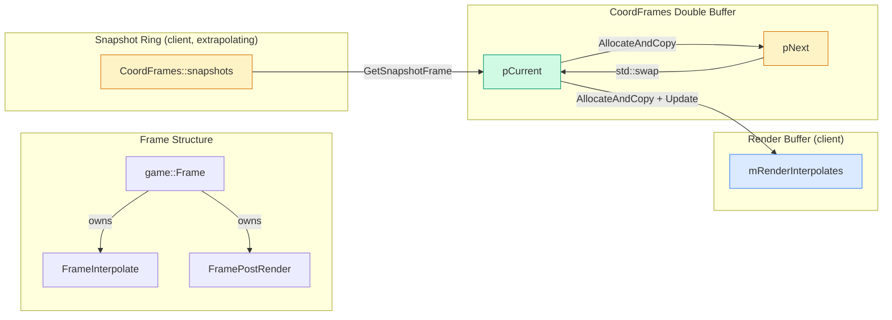
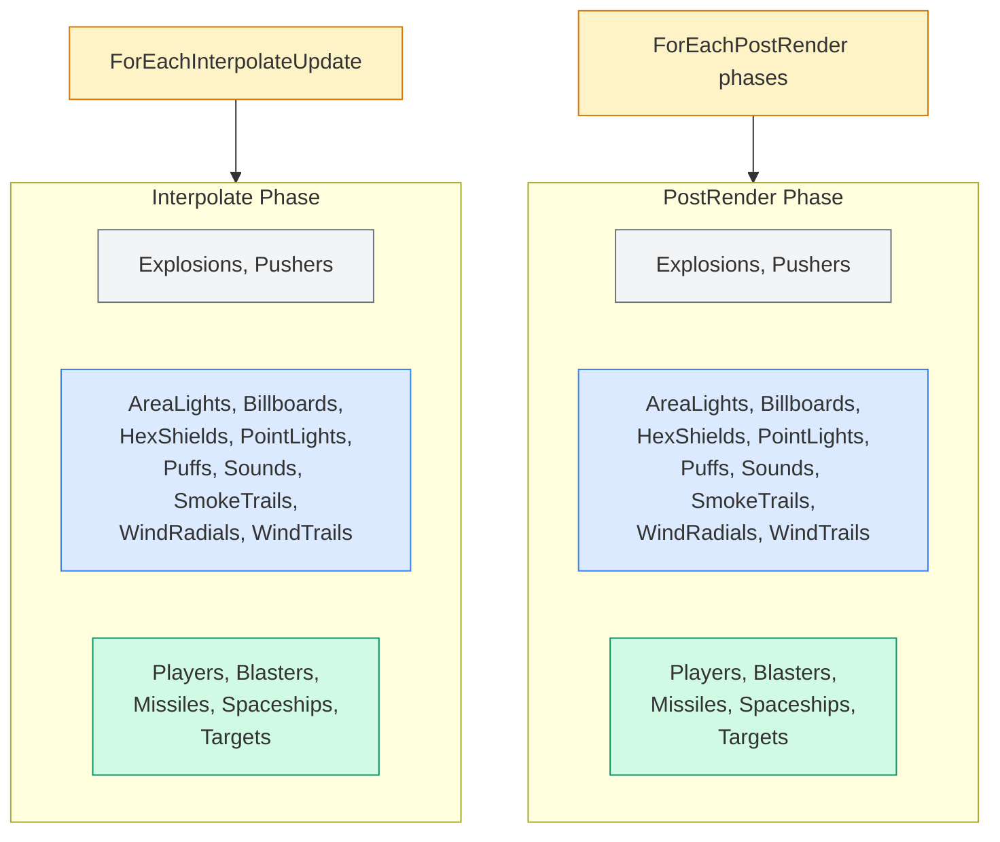

# Architecture: Frame Update Pipeline

> Auto-generated by `/generate-architecture-diagram` from `Engine/Source/Frame/` and `Engine/Source/Main.cpp`

## RunFrameTick Pipeline

All physics phases are unified into a single `RunFrameTick()` function (defined in `FrameTick.cpp`). Both `GameBase::ClientUpdate()` and reconciliation replay call the same function. Each Frame runs all five phases sequentially; multiple Frames are dispatched in parallel via `Dispatch()`.

```mermaid
%%{init: {'theme': 'default'}}%%
flowchart LR
    classDef interpolate fill:#dbeafe,stroke:#3b82f6
    classDef postrender fill:#fef3c7,stroke:#d97706
    classDef collision fill:#fee2e2,stroke:#ef4444
    classDef lifecycle fill:#d1fae5,stroke:#059669

    subgraph RunFrameTick ["RunFrameTick (per-Frame)"]
        subgraph Phase1 ["Phase 1: Interpolate"]
            i_alloc["AllocateAndCopy"]:::interpolate
            i_update["Update"]:::interpolate
        end

        subgraph Phase2 ["Phase 2: PostRender"]
            pr_alloc["AllocateAndCopy"]:::postrender
            pr_update["Update"]:::postrender
        end

        subgraph Phase3 ["Phase 3: Collision"]
            pr_precol["PreCollision"]:::collision
            collide["Collision::Collide"]:::collision
            pr_postcol["PostCollision"]:::collision
            pr_area["AreaDamage"]:::collision
        end

        subgraph Phase4 ["Phase 4: Transfer"]
            pr_transfer["Transfer"]:::lifecycle
        end

        subgraph Phase5 ["Phase 5: Destroy/Spawn"]
            pr_destroy["Destroy"]:::lifecycle
            pr_spawn["Spawn"]:::lifecycle
        end
    end

    i_alloc --> i_update
    i_update --> pr_alloc
    pr_alloc --> pr_update --> pr_precol --> collide --> pr_postcol --> pr_area --> pr_transfer --> pr_destroy --> pr_spawn
```

## Client Main Loop

Main.cpp calls `ProcessInput()`, `ClientUpdate()`, `Render()`, and `AudioManager::Update()` in sequence. Network orchestration is encapsulated within `ClientUpdate()` and `Render()`.



## Server Main Loop

Main.cpp calls `ServerUpdate()` then `ServerUpdateDisplayStats()`. Network orchestration is encapsulated within `GameBase::ServerUpdate()`, which delegates to `ServerSession` and `ServerSessionBase` methods.



## Dual-Buffered Frame Lifecycle



## Collection Phase Participation


