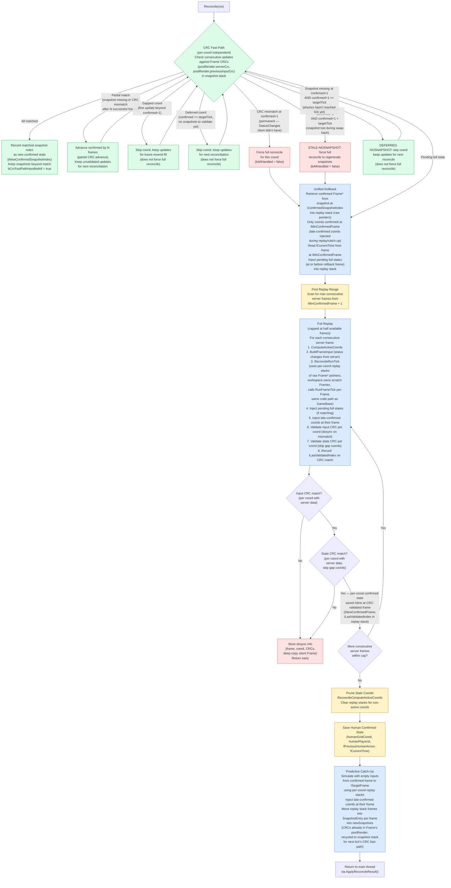
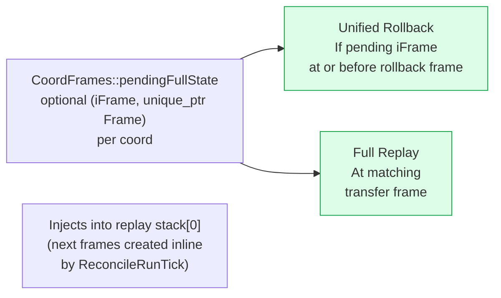
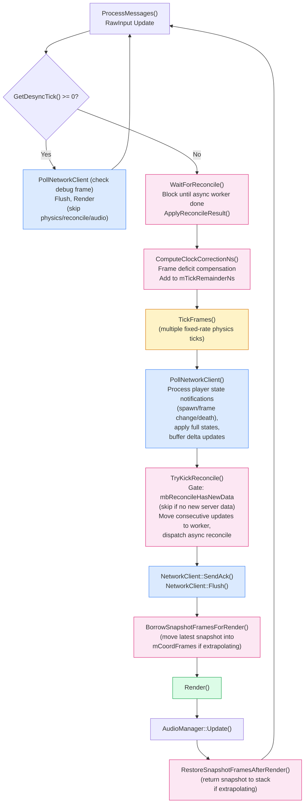
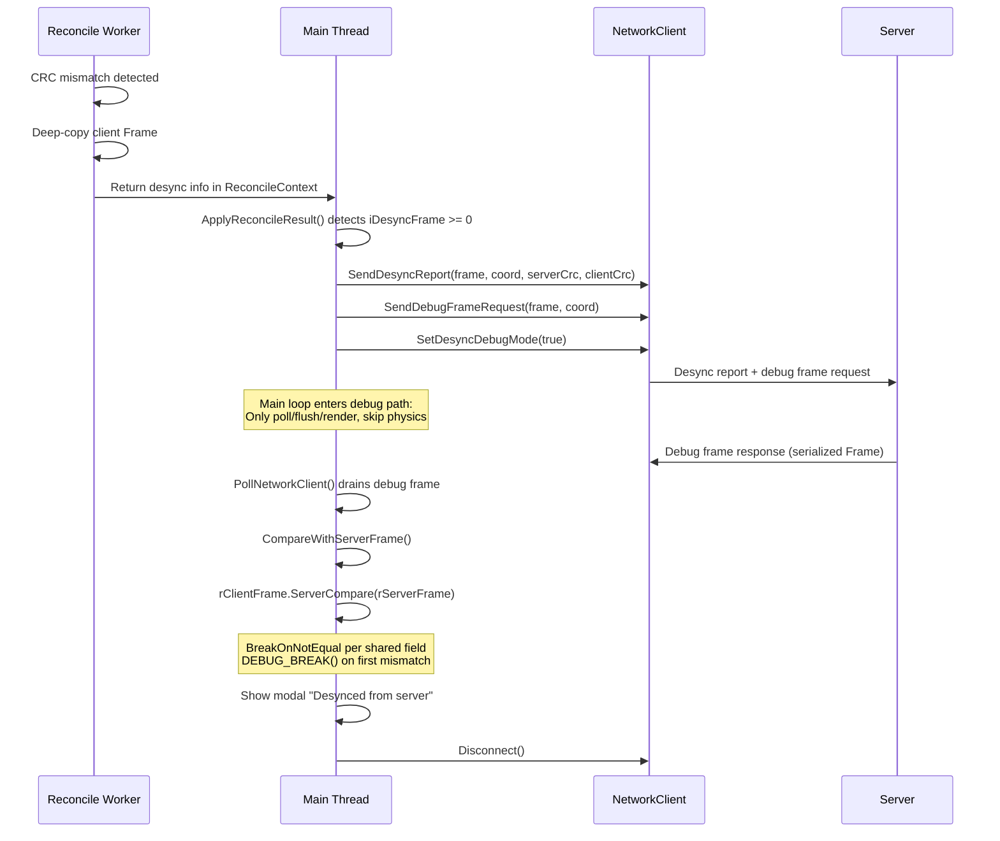

# Architecture: Game Reconciliation

> Auto-generated by `/generate-architecture-diagram` from `Projects/BrokenEngineSandbox/Source/`

## Reconciliation State Machine

CRC fast-path decision (with partial advance on mid-sequence failures, gap-skip for coords missing intermediate frames, deferred-skip for coords confirmed at or past the target tick, mismatch at confirmed+1 forcing full reconcile, stale-nosnapshot for lost snapshots forcing full reconcile, and deferred-nosnapshot for transient missing snapshots) through unified rollback, full replay (capped at half available frames), predictive catch-up, and snapshot storage. Full reconcile triggers for pending full states, CRC mismatches at confirmed+1, or stale missing snapshots. The entire pipeline runs on a dedicated `PersistentWorker` thread.



## Pending Full State Injection

Full states arrive during subscription changes (client subscribes to a new coord). Stored per-coord in `CoordFrames::pendingFullState` (an optional pair of frame number and unique_ptr Frame) and injected at two points:



## Main Loop Integration

Where reconciliation entry points sit relative to physics and render in the client main loop.



## Soft Clock Correction

Keeps client ~RTT/2 + 1 frames behind the server so updates arrive before the client simulates those frames, enabling routine CRC fast-path success.

```
iTargetBehind = ceil(RTT/2 / frameTime) + 1
iOffset       = preReconcileFrame - latestServerFrame
iError        = iOffset + iTargetBehind

correction    = -clamp(iError, -4, +4) * kTickNs / 64
                 ─────────────────────
                 Proportional, max ±4 steps, 1/64 frame per error unit

Applied: mTickRemainderNs += frameDeficit * kTickNs + correction
```

## Desync Debug Mode

CRC mismatch triggers a request for the server's full frame, then per-field comparison to pinpoint the exact divergence.



## Reconcile Context (Async Data Shuttle)

Data flows between main thread and worker via `ReconcileContext`, which contains per-coord `CoordReconcileWork` items:

| Direction | Fields |
|-----------|--------|
| **Main → Worker (per-coord)** | `CoordReconcileWork::iConfirmedFrame`, `iConfirmedSnapshotIndex`, `serverUpdates`, `snapshots` (SnapshotEntry stack; CRCs read from Frame's `postRender` fields), `pendingFullState`, `uiGeneration` |
| **Main → Worker (global)** | `confirmedHumanState`, `uiNextFrameId`, `iTargetFrame`, `playerAlignment` |
| **Worker internal** | per-coord `replayStack` (raw `Frame*` pointers)/`iReplayStackCount`, `replayWorkspace` (owns scratch Frames)/`iReplayWorkspaceUsed`, `iLastValidatedIndex` (in `CoordReconcileWork`), `frameInputs`, `activeCoords`, `humanGridCoord`, `iTickCounter`, `fCurrentTime` |
| **Worker → Main (per-coord)** | `CoordReconcileWork::iNewConfirmedFrame`, `iNewConfirmedSnapshotIndex`/`iNewConfirmedNewSnapshotIndex`, `newSnapshots` (SnapshotEntry from catch-up), `bCrcFastPath` |
| **Worker → Main (global)** | `newConfirmedHumanState`, `bCrcFastPathHandledAll` |
| **Worker → Main (profiling)** | `iCrcValidatedFrameTicks`, `iAssumedFrameTicks`, `iCrcFastPathEvents`, `iStatusChangeReplayTicks`, `iKnockOnReplayTicks` → fed to `ProfileManagerBase::SetReconcileCounters()` |
| **Desync (deferred)** | `iDesyncFrame`, `desyncCoord`, `desyncServerCrc`, `desyncClientCrc`, `pDesyncClientFrame` |

## Key Functions

| Function | Thread | Purpose |
|----------|--------|---------|
| `WaitForReconcile()` | Main | Block until async worker done, call `ApplyReconcileResult()` |
| `TryKickReconcile()` | Main | Gate on `mbReconcileHasNewData` (skip if no new server data), build per-coord `CoordReconcileWork` items, dispatch `KickReconcile()` |
| `KickReconcile()` | Main | Build `ReconcileContext` with per-coord work (move snapshots from `CoordFrames` to work), dispatch worker via `PersistentWorker` |
| `Reconcile()` | Worker | Static — runs per-coord CRC fast-path, unified rollback, full replay (capped), catch-up |
| `ApplyReconcileResult()` | Main | Apply per-coord worker results (guarded by `uiGeneration` to skip stale coords, only advance confirmed state when `iNewConfirmedFrame >= 0`), move latest replay stack entries into `mCoordFrames[coord].current` for rendering, recycle snapshots back to `CoordFrames`'s stack, merge catch-up newSnapshots, handle desync, restore unconsumed updates |
| `PollNetworkClient()` | Main | Process `ReceivedPlayerState` notifications (spawn/frame change/death via `kServerPlayerState`), apply full states to `CoordFrames`s, buffer per-slot deltas, check debug frame |
| `ApplyReceivedFullStates()` | Main | Route full states to `CoordFrames::pendingFullState` or `mCoordFrames[coord].current`; on initial connection, sets `confirmedHumanState.fCurrentTime` from first coord only |
| `ApplyReceivedUpdates()` | Main | Buffer per-slot updates into `CoordFrames::serverUpdates` |
| `UpdateSubscriptions()` | Main | Compute desired coords based on player state (alive: human + 3 quadrant neighbors via `ComputeQuadrantOffsets()`, dead: death coord + origin, not-yet-assigned: origin), unsubscribe stale coords, build `mSubscriptionQueue` |
| `TrySubscribeNext()` | Main | Pop next coord from `mSubscriptionQueue` and `SendSubscribe`; gates on no slot being in `kSubscribing`, `kWaitingFullState`, or `kUnsubscribing` state |
| `ComputeClockCorrectionNs()` | Main | Proportional clock correction from frame offset and RTT |
| `DetectPlayerDeathsServer()` | Main (server) | Detect player deaths server-side and send `kServerPlayerState(kDied)` to clients |
| `CompareWithServerFrame()` | Main | Per-field `ServerCompare()` with `BreakOnNotEqual` |
