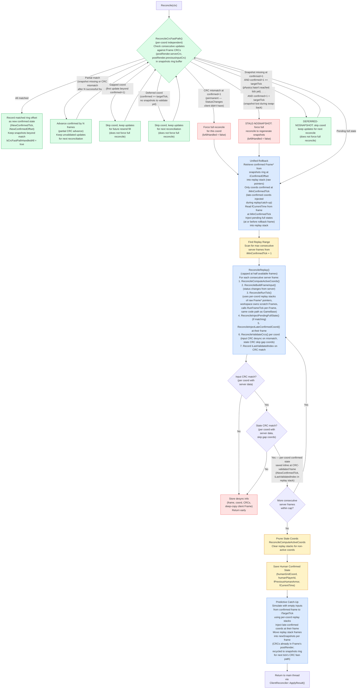
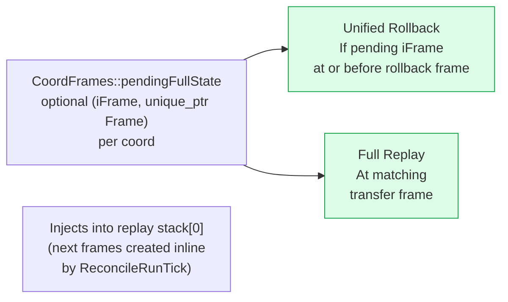
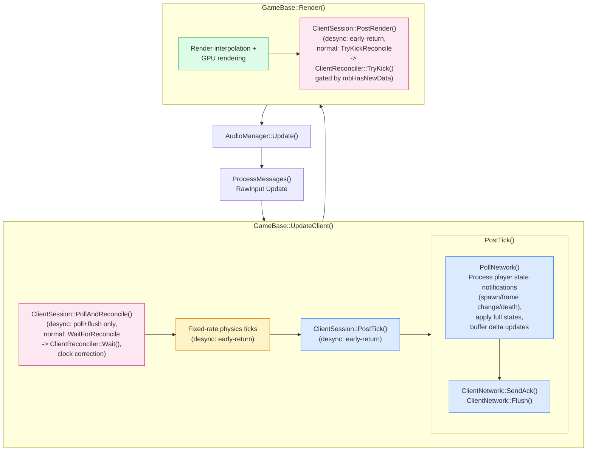
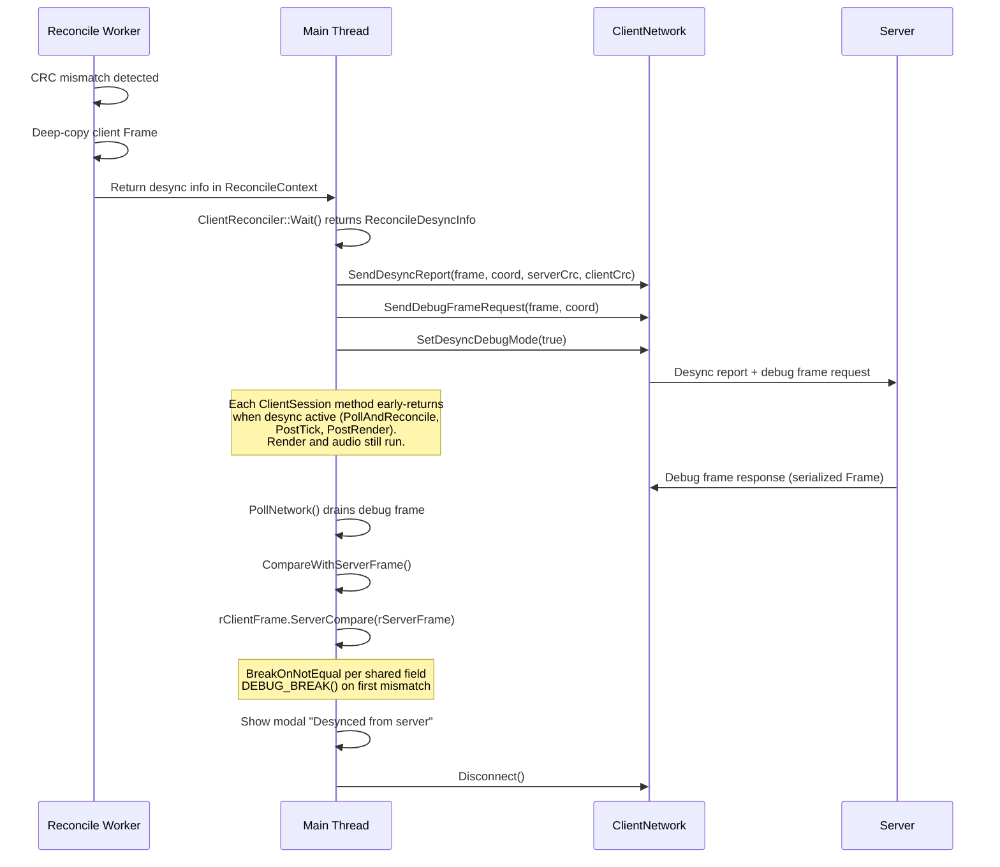

# Architecture: Game Reconciliation

> Auto-generated by `/generate-architecture-diagram` from `Projects/BrokenEngineSandbox/Source/`

## Reconciliation State Machine

CRC fast-path decision (with partial advance on mid-sequence failures, gap-skip for coords missing intermediate frames, deferred-skip for coords confirmed at or past the target tick, mismatch at confirmed+1 forcing full reconcile, stale-nosnapshot for lost snapshots forcing full reconcile, and deferred-nosnapshot for transient missing snapshots) through unified rollback, full replay (capped at half available frames), predictive catch-up, and snapshot ring buffer storage. Full reconcile triggers for pending full states, CRC mismatches at confirmed+1, or stale missing snapshots. The entire pipeline runs on a dedicated `PersistentWorker` thread. Snapshots are stored in a fixed-size ring buffer per coord (`iSnapshotHead`/`iSnapshotCount`), with confirmed state tracked as a logical offset (`iConfirmedOffset`) from the ring head.



## Pending Full State Injection

Full states arrive during subscription changes (client subscribes to a new coord). Stored per-coord in `CoordFrames::pendingFullState` (an optional pair of frame number and unique_ptr Frame) and injected at two points:



## Main Loop Integration

Where reconciliation entry points sit relative to physics and render in the client main loop. Network orchestration is encapsulated within `GameBase::UpdateClient()` and `GameBase::Render()`, which delegate to `ClientSession` methods (game-specific logic) and `ClientSessionBase` methods (engine-generic logic) — Main.cpp's loop simply calls `UpdateClient()`, `Render()`, and audio update.



## Soft Clock Correction

Keeps client ~RTT/2 + 1 frames behind the server so updates arrive before the client simulates those frames, enabling routine CRC fast-path success.

```
iTargetBehind = ceil(RTT/2 / frameTime) + 1
iOffset       = preReconcileFrame - latestServerFrame
iError        = iOffset + iTargetBehind

correction    = -clamp(iError, -4, +4) * kTickNs / 64
                 ─────────────────────
                 Proportional, max ±4 steps, 1/64 frame per error unit

Applied: mTickRemainderNs += frameDeficit * kTickNs + correction
```

## Desync Debug Mode

CRC mismatch triggers a request for the server's full frame, then per-field comparison to pinpoint the exact divergence.



## Reconcile Context (Async Data Shuttle)

Data flows between main thread and worker via `ReconcileContext`, which contains per-coord `CoordReconcileWork` items:

| Direction | Fields |
|-----------|--------|
| **Main → Worker (per-coord)** | `CoordReconcileWork::iConfirmedTick`, `iConfirmedOffset`, `iSnapshotHead`, `iSnapshotCount`, `serverUpdates`, `snapshots` (ring buffer; CRCs read from Frame's `postRender` fields), `pendingFullState`, `uiGeneration` |
| **Main → Worker (global)** | `confirmedHumanState`, `uiNextFrameId`, `iTargetTick`, `playerAlignment` |
| **Worker internal** | per-coord `replayStack` (raw `Frame*` pointers)/`iReplayStackCount`, `replayWorkspace` (owns scratch Frames)/`iReplayWorkspaceUsed`, `iLastValidatedIndex` (in `CoordReconcileWork`), `frameInputs`, `activeCoords`, `humanGridCoord`, `iTickCounter`, `fCurrentTime` |
| **Worker → Main (per-coord)** | `CoordReconcileWork::iNewConfirmedTick`, `iNewConfirmedOffset`/`iNewConfirmedNewSnapshotIndex`, `newSnapshots` (from catch-up), `bCrcFastPath` |
| **Worker → Main (global)** | `newConfirmedHumanState`, `bCrcFastPathHandledAll` |
| **Worker → Main (profiling)** | `iCrcValidatedFrameTicks`, `iAssumedFrameTicks`, `iCrcFastPathEvents`, `iStatusChangeReplayTicks`, `iKnockOnReplayTicks` → fed to `ProfileManagerBase::SetReconcileCounters()` |
| **Desync (deferred)** | `iDesyncTick`, `desyncCoord`, `desyncServerCrc`, `desyncClientCrc`, `pDesyncClientFrame` |

## Key Functions

| Function | Owner | Thread | Purpose |
|----------|-------|--------|---------|
| `WaitForReconcile()` | ClientSession | Main | Delegates to `ClientReconciler::Wait()`, handles desync result |
| `TryKickReconcile()` | ClientSession | Main | Delegates to `ClientReconciler::TryKick()` |
| `TryKick()` | ClientReconciler | Main | Gate on `mbHasNewData` (skip if no new server data), build per-coord `CoordReconcileWork` items, dispatch `Kick()` |
| `Kick()` | ClientReconciler | Main | Build `ReconcileContext` with per-coord work (move snapshots from `CoordFrames` ring buffer to work), dispatch worker via `PersistentWorker` |
| `Wait()` | ClientReconciler | Main | Block until async worker done, call `ApplyResult()`, return `ReconcileDesyncInfo` |
| `Reconcile()` | ClientReconciler | Worker | Static — orchestrates CRC fast-path, unified rollback, full replay (capped), catch-up |
| `ReconcileCrcFastPath()` | ReconcileReplay | Worker | Per-coord CRC fast-path check; returns (allHandled, minConfirmedTick) |
| `ApplyResult()` | ClientReconciler | Main | Apply per-coord worker results (guarded by `uiGeneration` to skip stale coords, only advance confirmed state when `iNewConfirmedTick >= 0`), move latest replay stack entries into `mCoordFrames[coord].current` for rendering, recycle snapshots back to `CoordFrames`'s ring buffer, merge catch-up newSnapshots, handle desync, restore unconsumed updates |
| `ApplyCoordWriteback()` | ClientReconciler | Main | Static — write back per-coord results (confirmed tick/offset, snapshots) from `CoordReconcileWork` to `CoordFrames` |
| `ReconcileRollback()` | ReconcileReplay | Worker | Retrieve confirmed frames from snapshots ring into replay stacks, inject pending full states |
| `ReconcileFindReplayRange()` | ReconcileReplay | Worker | Scan for max consecutive server frames from minConfirmedTick + 1 |
| `ReconcileReplay()` | ReconcileReplay | Worker | Full replay loop: BuildFrameInput, RunTick, inject full states/late coords, validate CRCs |
| `ReconcileRunTick()` | ReconcileReplay | Worker | Per-tick physics execution during replay/catch-up (calls RunFrameTick per-Frame) |
| `ReconcileComputeActiveCoords()` | ReconcileReplay | Worker | Compute active coords for current reconcile tick |
| `ReconcileBuildFrameInput()` | ReconcileReplay | Worker | Build per-coord frame inputs from server status changes |
| `ReconcileInjectPendingFullState()` | ReconcileReplay | Worker | Inject pending full state into coord replay stack |
| `ReconcileInjectLateConfirmedCoord()` | ReconcileReplay | Worker | Inject late-confirmed coord at its confirmed frame |
| `ReconcileValidateCrcs()` | ReconcileReplay | Worker | Validate input and state CRCs per coord per frame |
| `ReconcileCatchUp()` | ReconcileReplay | Worker | Predictive catch-up from confirmed frame to target tick with empty inputs |
| `ReconcilePruneInactiveFrames()` | ReconcileReplay | Worker | Clear replay stacks for non-active coords |
| `PollNetwork()` | ClientSession | Main | Process `ReceivedPlayerState` notifications (spawn/frame change/death via `kServerPlayerState`), apply full states to `CoordFrames`s, buffer per-slot deltas, check debug frame |
| `ApplyReceivedFullStates()` | ClientSession | Main | Route full states to `CoordFrames::pendingFullState` or `mCoordFrames[coord].current`; on initial connection, sets `confirmedHumanState.fCurrentTime` from first coord only |
| `ApplyReceivedUpdates()` | ClientSession | Main | Call `ApplyReceivedUpdatesBase()` (engine) to buffer per-slot updates into `CoordFrames::serverUpdates` |
| `UpdateSubscriptions()` | ClientSession | Main | Compute desired coords based on player state (alive: human + 3 quadrant neighbors via `ComputeQuadrantOffsets()`, dead: death coord + origin, not-yet-assigned: origin), delegate to `UnsubscribeStaleCoords()` and `BuildSubscriptionQueue()` (engine base) |
| `TrySubscribeNext()` | ClientSessionBase | Main | Pop next coord from `mSubscriptionQueue` and `SendSubscribe`; gates on no slot being in `kSubscribing`, `kWaitingFullState`, or `kUnsubscribing` state |
| `ComputeClockCorrectionNs()` | ClientSessionBase | Main | Proportional clock correction from frame offset and RTT |
| `ServerSession::DetectPlayerDeaths()` | ServerSession | Main (server) | Detect player deaths server-side and send `kServerPlayerState(kDied)` to clients |
| `UnsubscribeStaleCoords()` | ClientSessionBase | Main | Unsubscribe coords no longer in the desired set |
| `BuildSubscriptionQueue()` | ClientSessionBase | Main | Build `mSubscriptionQueue` from desired coords not yet subscribed |
| `IsExtrapolating()` | ClientSessionBase | Main | Returns whether the client is in extrapolation mode (no confirmed server data yet) |
| `PrepareExtrapolationTick()` | ClientSessionBase | Main | Set up snapshot ring buffer for next extrapolation tick |
| `BuildExtrapolationFrameRef()` | ClientSessionBase | Main | Redirect ActiveFrameRef to snapshot stack for extrapolation |
| `RecordExtrapolationSnapshot()` | ClientSessionBase | Main | Advance snapshot count after extrapolation tick (CRCs already in Frame from RunFrameTick) |
| `GetSnapshotFrame()` | ClientSessionBase | Main | Get latest snapshot Frame for a coord |
| `GetConfirmedTick()` | ClientSessionBase | Main | Return the latest confirmed server tick |
| `ConnectToServer()` | ClientSessionBase | Main | Create ClientNetwork and connect to server via ENet |
| `DisconnectFromServerBase()` | ClientSessionBase | Main | Tear down ClientNetwork and reset connection state |
| `ApplyReceivedUpdatesBase()` | ClientSessionBase | Main | Buffer per-slot updates into `CoordFrames::serverUpdates` |
| `WaitForTick()` | ServerSessionBase | Main (server) | Waitable timer + spin-wait until next server tick |
| `PollNetworkBase()` | ServerSessionBase | Main (server) | Poll ENet events and DiscoveryResponder |
| `SendNewSubscriptionFullStates()` | ServerSessionBase | Main (server) | Send full state for newly subscribed coords |
| `CompareWithServerFrame()` | ClientSession | Main | Per-field `ServerCompare()` with `BreakOnNotEqual` |
