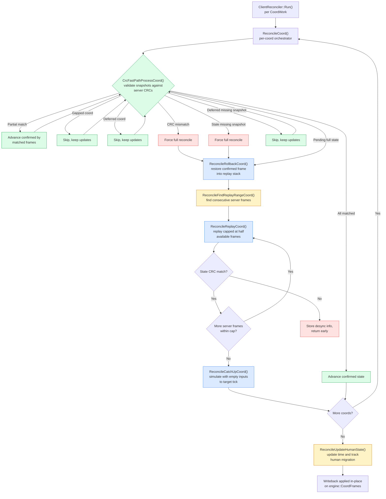
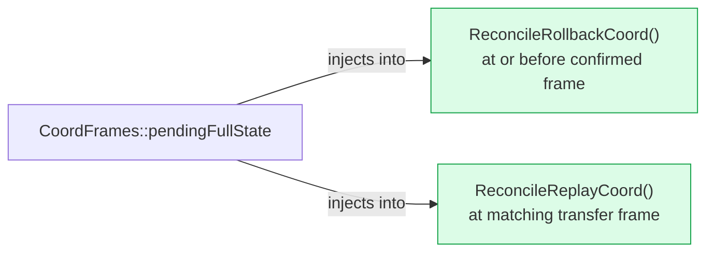
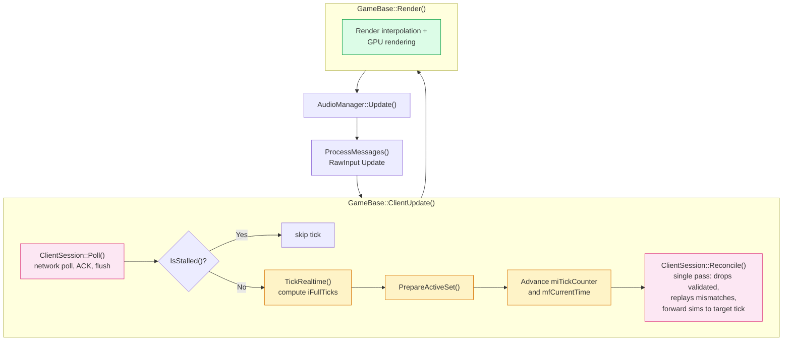
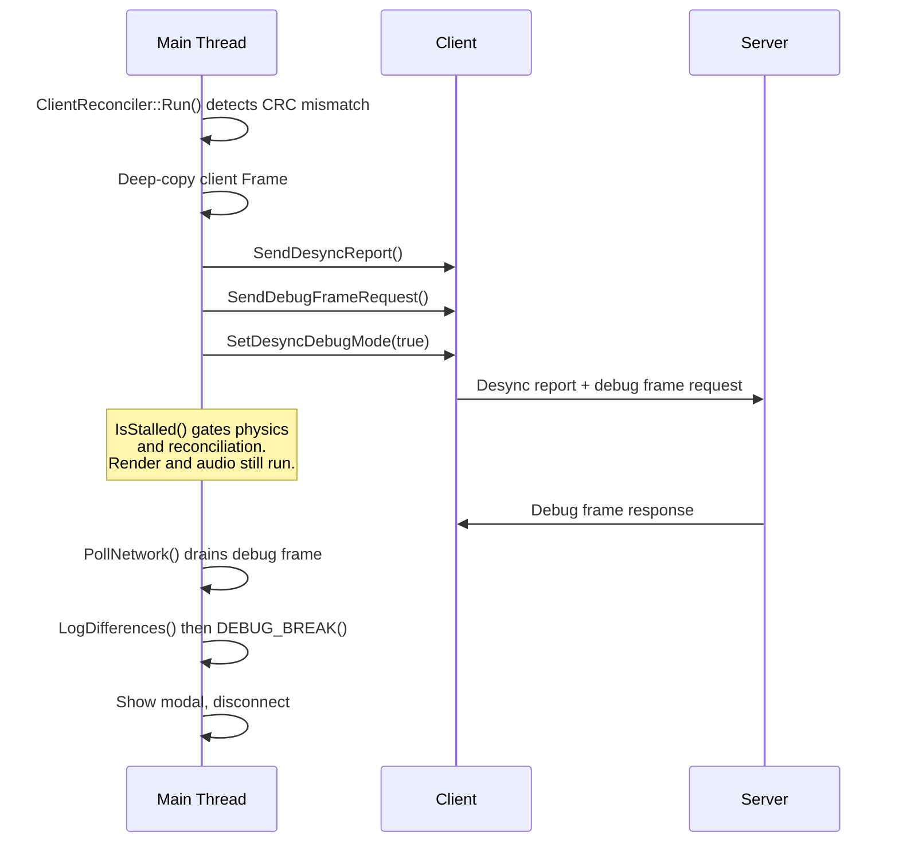
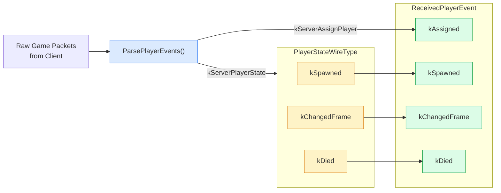

# Architecture: Game Reconciliation

> Auto-generated by `/generate-architecture-diagram` from `Projects/BrokenEngineSandbox/Source/`

## Reconciliation State Machine

Each coord is reconciled independently through CRC fast-path, per-coord rollback, replay, catch-up, and snapshot ring buffer storage. The pipeline runs synchronously on the main thread from `ClientUpdate()` in a single pass (drops validated old frames, replays mismatches, and forward-sims empty-input ticks up to the post-advance `miTickCounter`). Per-coord work is parallelized via `common::gpMultithreading->Dispatch()`.

## Pending Full State Injection

Full states arrive during subscription changes and are injected at two points during reconciliation:

## Extrapolation Mode

No longer a distinct mode. Forward simulation from the confirmed server state is performed inline by `ClientReconciler::Run()`'s catch-up pass (`ReconcileCatchUpCoord` simulates empty-input ticks up to the post-advance `miTickCounter`). The snapshot ring (`CoordFrames::snapshots[]`) is now the unified state buffer — there is no separate extrapolation stack or transition step.

## Main Loop Integration

Where reconciliation sits relative to render in the client main loop. There is no separate physics tick loop on the client — reconciliation's catch-up pass is the forward sim.

## Desync Debug Mode

CRC mismatch triggers a request for the server's full frame, then per-field comparison to pinpoint the exact divergence.

## Player Event Parsing

Raw game packets are parsed into typed events. `kServerAssignPlayer` maps directly to `kAssigned`; `kServerPlayerState` packets carry a `PlayerStateWireType` that maps to the remaining event types.

