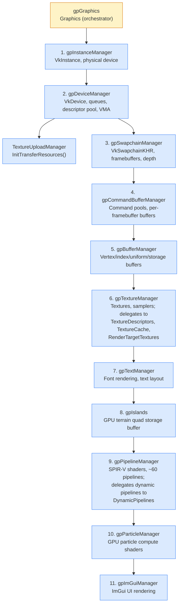
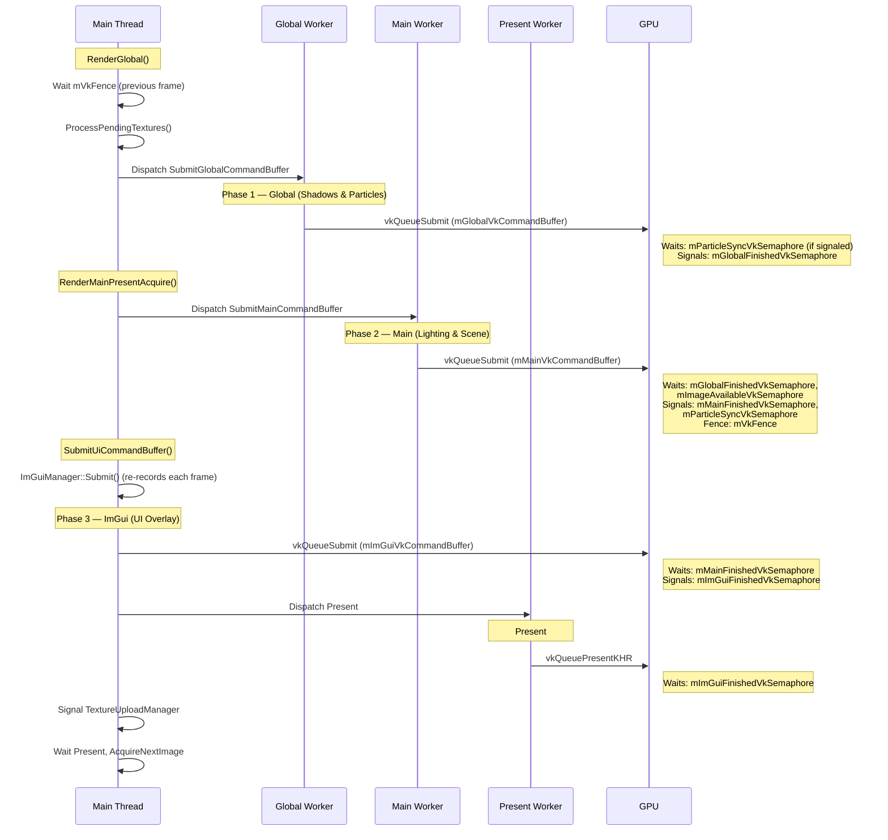
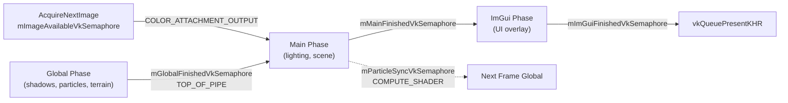
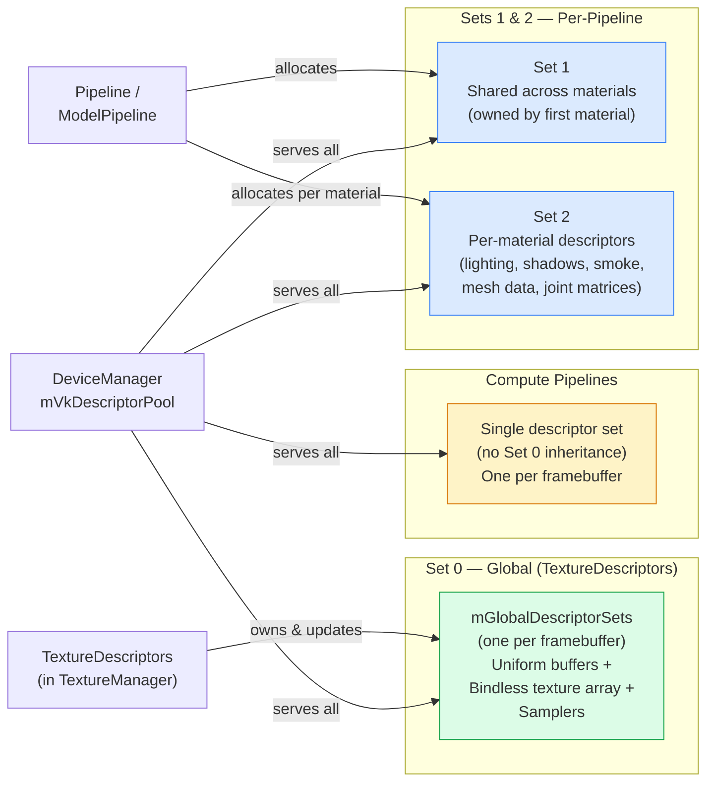

# Architecture: Graphics Pipeline

> Auto-generated by `/generate-architecture-diagram` from `Engine/Source/Graphics/`

## Manager Initialization Order

Strict dependency DAG — each manager requires all predecessors to be fully initialized. Violations cause Vulkan validation errors or crashes.



## Per-Frame GPU Submission

Three semaphore-synchronized submissions per frame, plus present. `mVkFence` gates the CPU from running ahead of the GPU.



## Semaphore Chain



## Descriptor Set Ownership



## Global Phase Workload

Recorded once at startup via `RecordGlobalCommandBuffer()`, resubmitted every frame.

```
Particle Spawn (compute) ─► Shadow Elevation (render) ─► Shadow + Blur (compute)
    │
    ├─► Terrain Elevation/Color/Normal/AO (render)
    ├─► Wind Spread A/B + Clear (indirect render)
    ├─► Smoke Spread A/B + Clear (indirect render)
    └─► Particle Update (compute, indirect)
```

## Main Phase Workload

Recorded once at startup via `RecordMainCommandBuffer()`, resubmitted every frame.

```
Lighting Pass (dynamic + particles) ─► Lighting Blur (ping-pong) ─► Lighting Combine
    │
    ├─► Smoke Emit
    ├─► Wind Deposit (2 passes)
    ├─► Object Shadows + Blur
    └─► Main Image Pass:
            Opaque models (indirect) ─► Terrain ─► Water
            ─► Hex shields ─► Transparent models (indirect)
            ─► Particles (indirect) ─► Visible lights ─► Billboards ─► Profile text
```

## Resource Recreation Cascade

`DestroyType` enum — each level includes all lower levels:

| Level | Trigger | What gets recreated |
|-------|---------|-------------------|
| `kCommandBuffers` | Settings change (blur divisors) | Re-record command buffers |
| `kSamplers` | Anisotropy / mip bias change | Samplers + descriptor sets |
| `kPipelines` | Wireframe / sample shading / shader specialization | All ~60 pipelines |
| `kSwapchain` | Window resize / present mode | Full swapchain (TextureManager/BufferManager survive) |
| `kSurface` | Device lost | Everything destroyed and reconstructed |

`DestroyFlags` bitflags for targeted recreation: `kTerrainMesh`, `kShadowTextures`, `kObjectShadows`, `kLightingTextures`, `kWaterMesh`, `kTerrainElevation`, `kTerrainColor`, `kTerrainNormal`, `kTerrainAO`, `kSmokeTextures`

## Command Buffer Architecture

Per-framebuffer `CommandBuffers` struct:

| Buffer | Content | Recording |
|--------|---------|-----------|
| `mGlobalVkCommandBuffer` | Shadows, particles, terrain | Recorded once, reused |
| `mMainVkCommandBuffer` | Deferred lighting, scene | Recorded once, reused |
| `mImGuiVkCommandBuffer` | UI overlay | Re-recorded every frame |

Synchronization primitives per `CommandBuffers`:
- `mVkFence` — CPU/GPU sync (signaled by Main, waited by next frame's Global)
- `mGlobalFinishedVkSemaphore` — Global → Main
- `mMainFinishedVkSemaphore` — Main → ImGui
- `mImGuiFinishedVkSemaphore` — ImGui → Present
