# Architecture: Network

> Auto-generated by `/generate-architecture-diagram` from `Engine/Source/Network/`

## Network Component Relationships

```mermaid
%%{init: {'theme': 'default'}}%%
graph TD
    classDef clientOnly fill:#dbeafe,stroke:#3b82f6
    classDef serverOnly fill:#fee2e2,stroke:#ef4444
    classDef shared fill:#f3f4f6,stroke:#6b7280
    classDef protocol fill:#fef3c7,stroke:#d97706

    subgraph engine_network ["engine:: Network Subsystem"]
        gpNetworkManager["gpNetworkManager<br/>NetworkManager<br/>(ENet lifecycle)<br/>kiMaxEnetCoordSlots=64<br/>kuiChannelCount=130<br/>(2 control + 64 slot pairs)<br/>IsUnreliableChannel()"]:::shared

        gpClient["gpClient<br/>Client<br/>(mpHost, mpServerPeer)"]:::clientOnly
        gpServer["gpServer<br/>Server<br/>(mpHost, mClients[])"]:::serverOnly

        server_types["ServerTypes.h<br/>ClientCoordSubscription<br/>PendingSpawnRequest<br/>PendingDisconnect<br/>PendingNewSubscription<br/>GridUpdateData"]:::serverOnly
        protocol["NetworkProtocol.h<br/>PacketType enum (15 types)<br/>AckState struct<br/>kuiProtocolVersion<br/>kiClockErrorDisconnectThreshold"]:::protocol
        simulation["NetworkSimulation.h<br/>NetworkSimulationLevel enum<br/>NetworkSimulationConfig<br/>DelayedPacket<br/>EnqueueOrDrop / ProcessDelayed<br/>(latency + loss injection)"]:::shared
        serialization["NetworkSerialization<br/>StatusChange compress/decompress<br/>(LZ4)"]:::shared
        cursor["NetworkCursor<br/>Inline binary read/write helpers<br/>(ReadUint8..ReadVec4, ReadGridCoord,<br/>WriteUint8..WriteVec4)"]:::shared
        discovery_scanner["NetworkDiscoveryScanner<br/>(UDP broadcast probe)"]:::clientOnly
        discovery_responder["NetworkDiscoveryResponder<br/>(UDP listen on port 27016)"]:::serverOnly
        client_session_base["ClientSessionBase<br/>(owns Client +<br/>DiscoveryScanner)<br/>ConnectToServer, DisconnectFromServerBase,<br/>StartServerDiscovery, PollLANDiscovery,<br/>TrySubscribeNext, UnsubscribeStaleCoords,<br/>BuildSubscriptionQueue,<br/>ApplyReceivedUpdatesBase,<br/>ComputeClockCorrectionNs,<br/>(mbClockErrorDisconnect on extreme drift),<br/>IsExtrapolating, PrepareExtrapolationTick,<br/>BuildExtrapolationFrameRef,<br/>RecordExtrapolationSnapshot, GetSnapshotFrame,<br/>GetConfirmedTick, GetServerUpdateBufferSize"]:::clientOnly
        session_base["ServerSessionBase<br/>(owns DiscoveryResponder,<br/>mTimerHandle for tick sleep)<br/>WaitForTick, PollNetworkBase,<br/>SendNewSubscriptionFullStates"]:::serverOnly
    end

    subgraph server_data ["Server-Side Data"]
        client_conn["ClientConnection<br/>pPeer, iClientId, humanPlayerId,<br/>humanGridCoord,<br/>coordSubscriptions (vector),<br/>coordAckStates (vector) (floor+bitfield+epoch),<br/>iClientTimestampNs"]:::serverOnly
        buffered["mPerCoordBufferedFrames<br/>(per-coord ring buffers, 256 max)<br/>PerCoordBufferedFrame: serverCrc + inputCrc<br/>+ compressed data<br/>mBufferedFullFrames<br/>(debug frame ring buffer)"]:::serverOnly
        pending["mPendingSpawnRequests<br/>mPendingDisconnects<br/>mPendingNewSubscriptions"]:::serverOnly
        delayed_server["mDelayedPackets<br/>(network simulation delay queue)"]:::serverOnly
    end

    subgraph client_data ["Client-Side Data"]
        received["mReceivedCoordUpdates (vector)<br/>(per-slot update buffers)<br/>ReceivedCoordUpdate: serverCrc + inputCrc<br/>+ statusChanges<br/>mReceivedFullStates<br/>mReceivedGamePackets<br/>(raw bytes for game-layer parsing)"]:::clientOnly
        ack_state["Per-Slot ACK State<br/>ClientCoordSlot (vector)<br/>(coord, state, ackFloor, bitfield, epoch)"]:::clientOnly
        delayed["mDelayedPackets<br/>(network simulation delay queue)"]:::clientOnly
    end

    gpServer -->|includes| server_types
    gpNetworkManager -->|initializes| gpClient
    gpNetworkManager -->|initializes| gpServer
    gpClient -->|uses| protocol
    gpServer -->|uses| protocol
    gpClient -->|uses| simulation
    gpServer -->|uses| simulation
    gpClient -->|uses| serialization
    gpServer -->|uses| serialization
    gpClient -->|uses| cursor
    gpServer -->|uses| cursor
    serialization -->|uses| cursor
    gpServer -->|manages| client_conn
    gpServer -->|stores| buffered
    gpServer -->|queues| pending
    gpServer -->|delays| delayed_server
    gpClient -->|buffers| received
    gpClient -->|tracks| ack_state
    client_session_base -->|owns| gpClient
    client_session_base -->|owns| discovery_scanner
    session_base -->|owns| discovery_responder
    discovery_scanner -->|probes| discovery_responder
```

## Connection Handshake Sequence

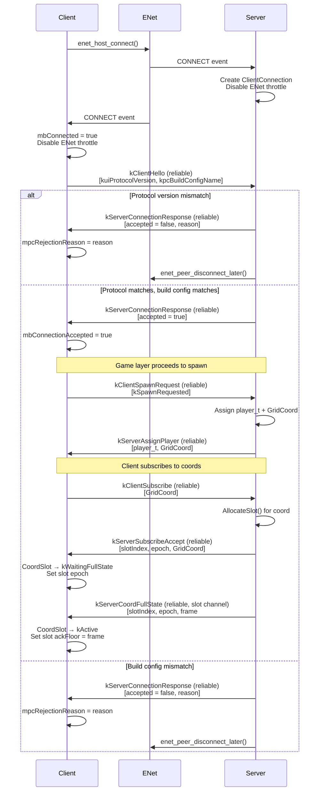

## Steady-State Update Flow

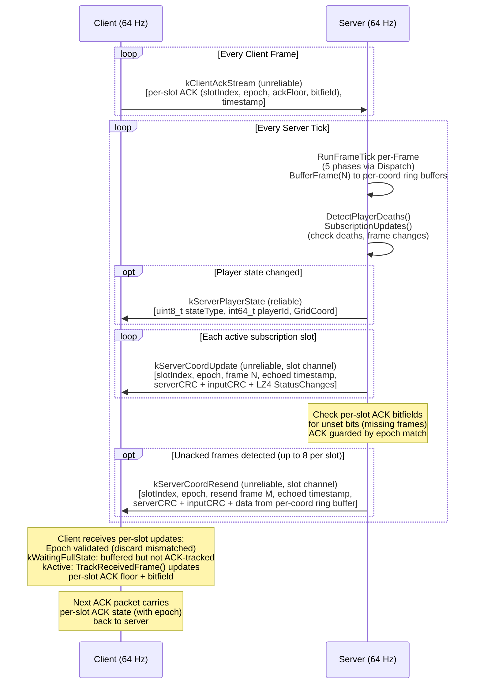

## ACK & Resend Mechanism

Per-slot bitfield-based acknowledgement with epoch validation and capped resend budget. Client ACKs are sent every frame; server scans unset bits to detect and resend missing frames.

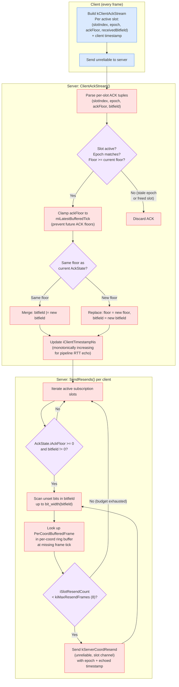

## Server Tick Broadcasting Pipeline

Per-tick server flow from finalizing new clients through flushing all packets. Status changes include both spawns and transfers; per-coord data is buffered into ring buffers then sent per-client per-slot.

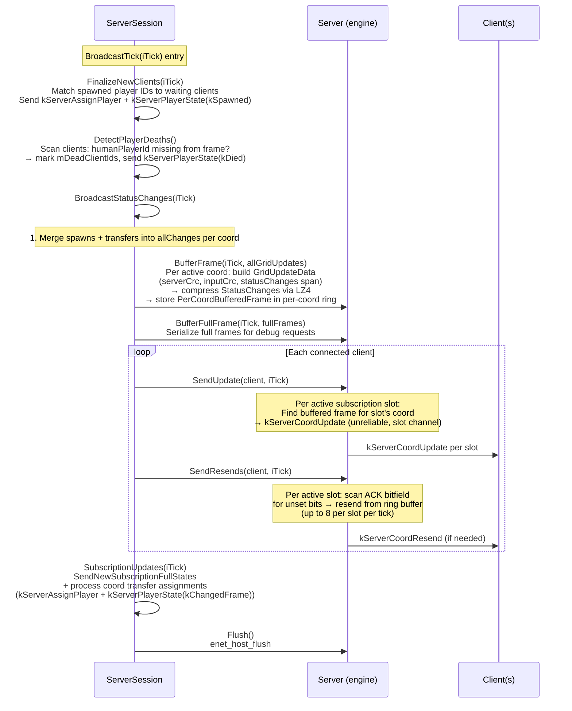

## Death & Respawn Lifecycle

Full death-to-respawn cycle covering server detection, client UI, and spawn request processing.

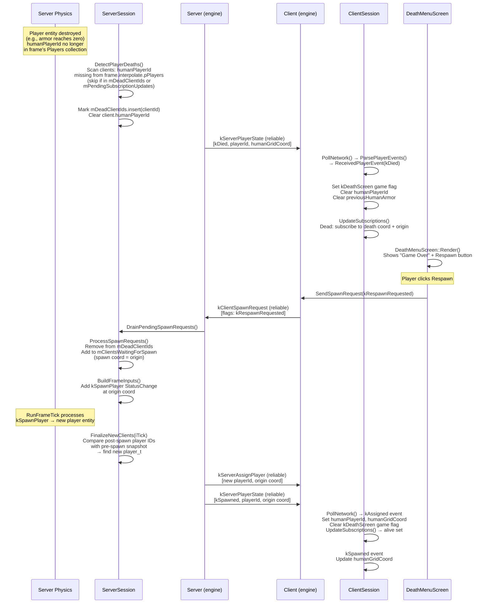

## Coord Transfer Flow

Cross-cell entity migration when physics produces `TransferRequest`s at grid cell boundaries. The server harvests transfers, spawns entities in destination frames, and notifies clients of human player relocations.

```mermaid
%%{init: {'theme': 'default'}}%%
flowchart TD
    classDef physics fill:#fef3c7,stroke:#d97706
    classDef server fill:#fee2e2,stroke:#ef4444
    classDef client fill:#dbeafe,stroke:#3b82f6
    classDef decision fill:#f3e8ff,stroke:#9333ea

    PHYSICS["Physics postRender phase<br/>produces TransferRequests<br/>(eType, data, iDeltaX/Y, iEntityId)"]:::physics

    HARVEST["ServerSession::HarvestTransfers()<br/>Called between RunFrameTick<br/>and BroadcastTick"]:::server

    COLLECT["CollectTransfers()<br/>For each active coord's transferRequests:<br/>Compute dest = coord + delta<br/>Store StatusChange in mTickBroadcast.transfers[dest]<br/>Track human transfers (iEntityId != 0)"]:::server

    SORT["SortTransfersByType()<br/>Sort StatusChanges per dest coord<br/>by eType (deterministic order)"]:::server

    SPAWN["SpawnTransfers()<br/>For each dest coord's transfers:<br/>SpawnTransfer() into dest next frame<br/>(creates entity in destination)<br/>Then recompute CRCs for dest frames<br/>(serverCrc + crc)"]:::server

    TRACK["TrackHumanTransfers()<br/>For each human transfer:<br/>Find client by old humanPlayerId<br/>Look up new player ID in dest frame<br/>(last spawned player in dest)<br/>Queue SubscriptionUpdate"]:::server

    BROADCAST["BroadcastStatusChanges(iTick)<br/>Merges transfers with spawns<br/>→ compressed into PerCoordBufferedFrame<br/>→ sent to all subscribed clients"]:::server

    SUBUPDATE["SubscriptionUpdates(iTick)<br/>For each pending SubscriptionUpdate:<br/>SendAssignPlayer(clientId, newPlayerId, newCoord)<br/>SendPlayerState(kChangedFrame, newPlayerId, newCoord)"]:::server

    CLIENT_RECV["Client receives:<br/>kServerAssignPlayer → update humanPlayerId<br/>kServerPlayerState(kChangedFrame)<br/>→ update humanGridCoord<br/>→ recompute desired subscriptions<br/>(human cell + 3 quadrant neighbors)"]:::client

    PHYSICS --> HARVEST --> COLLECT --> SORT --> SPAWN --> TRACK
    TRACK --> BROADCAST --> SUBUPDATE --> CLIENT_RECV
```

## Client Disconnection

Cleanup flow when a client disconnects, covering server-side resource cleanup and broadcasting the player destruction to remaining clients.

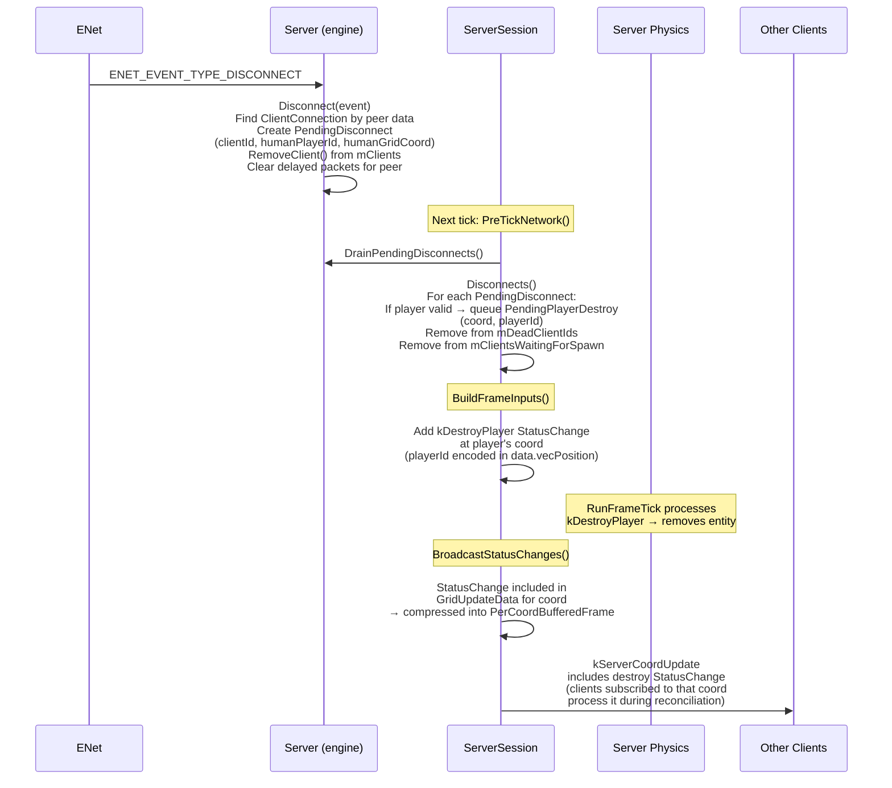

## Packet Types

```mermaid
%%{init: {'theme': 'default'}}%%
graph LR
    classDef reliable fill:#d1fae5,stroke:#059669
    classDef unreliable fill:#fef3c7,stroke:#d97706
    classDef clientPkt fill:#dbeafe,stroke:#3b82f6
    classDef serverPkt fill:#fee2e2,stroke:#ef4444

    subgraph client_to_server ["Client -> Server"]
        kClientHello["kClientHello<br/>(reliable)"]:::reliable
        kClientAckStream["kClientAckStream<br/>(unreliable, every frame)<br/>per-slot ACK state, timestamp"]:::unreliable
        kClientSpawnRequest["kClientSpawnRequest<br/>(reliable)"]:::reliable
        kClientSubscribe["kClientSubscribe<br/>(reliable, coord request)"]:::reliable
        kClientUnsubscribe["kClientUnsubscribe<br/>(reliable, slot release)"]:::reliable
        kClientDesyncReport["kClientDesyncReport<br/>(reliable, on CRC mismatch)"]:::reliable
        kClientDebugFrameRequest["kClientDebugFrameRequest<br/>(reliable)"]:::reliable
    end

    subgraph server_to_client ["Server -> Client"]
        kServerConnectionResponse["kServerConnectionResponse<br/>(reliable)"]:::reliable
        kServerAssignPlayer["kServerAssignPlayer<br/>(reliable, on spawn)"]:::reliable
        kServerSubscribeAccept["kServerSubscribeAccept<br/>(reliable, slot+epoch+coord)"]:::reliable
        kServerUnsubscribeAck["kServerUnsubscribeAck<br/>(reliable, slot release)"]:::reliable
        kServerCoordFullState["kServerCoordFullState<br/>(reliable, slot channel, epoch)"]:::reliable
        kServerCoordUpdate["kServerCoordUpdate<br/>(unreliable, slot channel, epoch, every tick)"]:::unreliable
        kServerCoordResend["kServerCoordResend<br/>(unreliable, slot channel, epoch, as needed)"]:::unreliable
        kServerPlayerState["kServerPlayerState<br/>(reliable, raw bytes<br/>for game-layer parsing)"]:::reliable
        kServerDebugFrame["kServerDebugFrame<br/>(reliable, on request)"]:::reliable
    end
```

## Coord Subscription Lifecycle

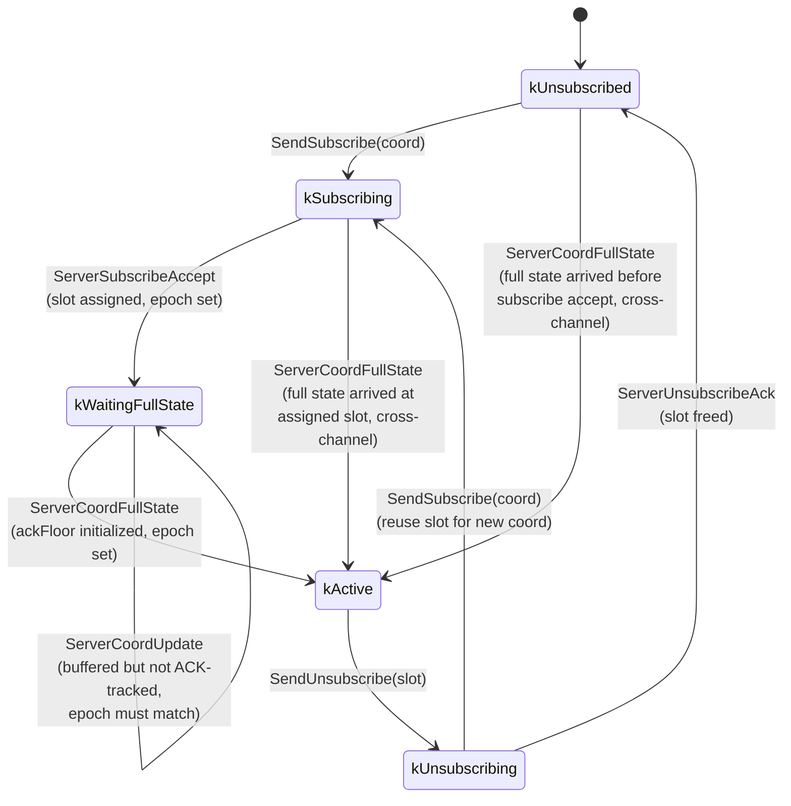

## Client-Side Reconciliation

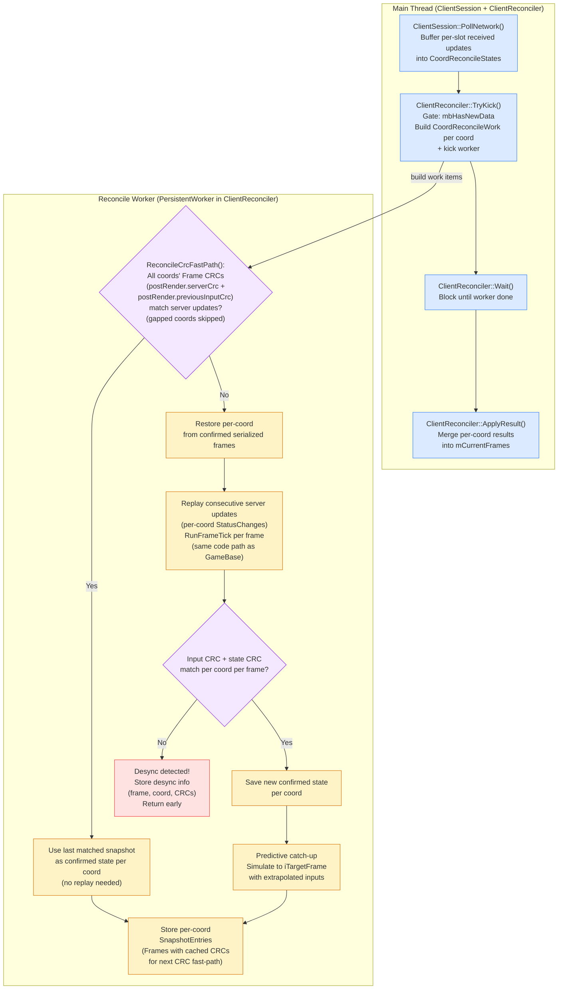
