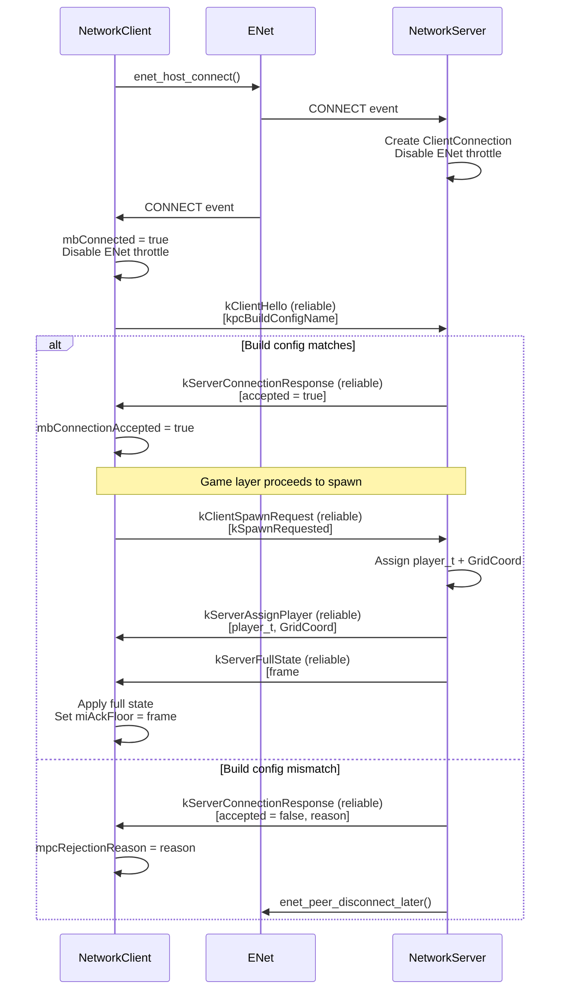
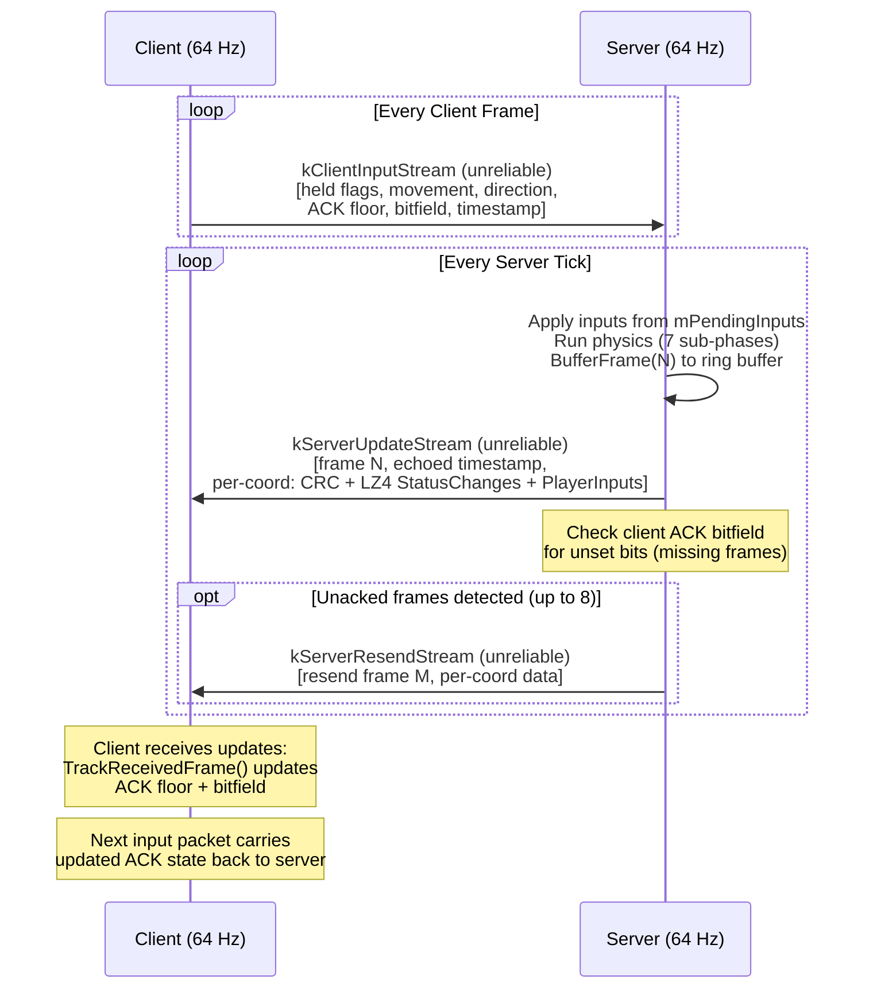
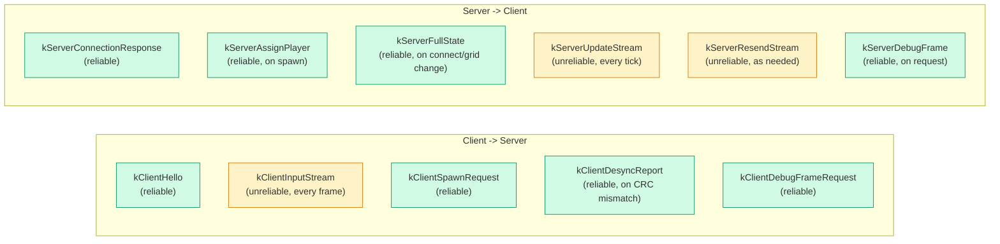
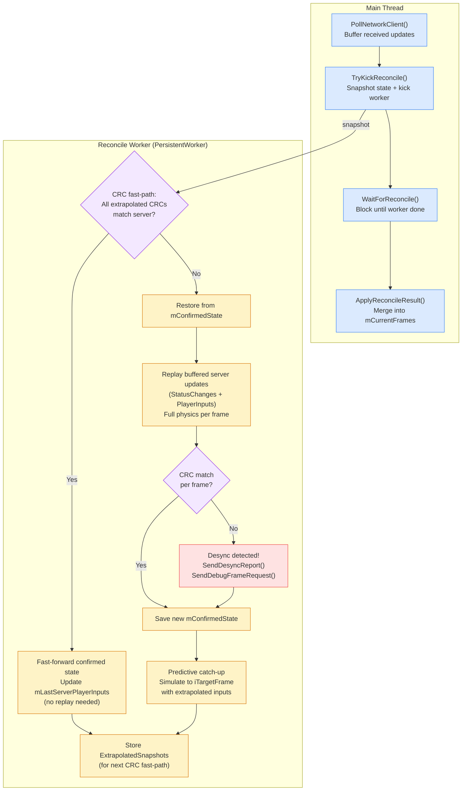

# Architecture: Network

> Auto-generated by `/generate-architecture-diagram` from `Engine/Source/Network/`

## Network Component Relationships

```mermaid
%%{init: {'theme': 'default'}}%%
graph TD
    classDef clientOnly fill:#dbeafe,stroke:#3b82f6
    classDef serverOnly fill:#fee2e2,stroke:#ef4444
    classDef shared fill:#f3f4f6,stroke:#6b7280
    classDef protocol fill:#fef3c7,stroke:#d97706

    subgraph engine_network ["engine:: Network Subsystem"]
        gpNetworkManager["gpNetworkManager<br/>NetworkManager<br/>(ENet lifecycle)"]:::shared

        gpNetworkClient["gpNetworkClient<br/>NetworkClient<br/>(mpHost, mpServerPeer)"]:::clientOnly
        gpNetworkServer["gpNetworkServer<br/>NetworkServer<br/>(mpHost, mClients[])"]:::serverOnly

        protocol["NetworkProtocol.h<br/>PacketType enum (11 types)<br/>Channel constants"]:::protocol
        serialization["NetworkSerialization<br/>StatusChange compress/decompress<br/>(LZ4)"]:::shared
        discovery_scanner["NetworkDiscoveryScanner<br/>(UDP broadcast probe)"]:::clientOnly
        discovery_responder["NetworkDiscoveryResponder<br/>(UDP listen on port 27016)"]:::serverOnly
    end

    subgraph server_data ["Server-Side Data"]
        client_conn["ClientConnection<br/>pPeer, iClientId, uiPlayerId,<br/>activeCoords[], ACK state"]:::serverOnly
        buffered["mBufferedFrames<br/>(ring buffer, 256 max)"]:::serverOnly
        pending["mPendingInputs<br/>mPendingSpawnRequests<br/>mPendingDisconnects"]:::serverOnly
    end

    subgraph client_data ["Client-Side Data"]
        received["mReceivedUpdates<br/>mReceivedFullStates"]:::clientOnly
        ack_state["ACK State<br/>miAckFloor + 64-bit bitfield"]:::clientOnly
        delayed["mDelayedPackets<br/>(network simulation)"]:::clientOnly
    end

    gpNetworkManager -->|initializes| gpNetworkClient
    gpNetworkManager -->|initializes| gpNetworkServer
    gpNetworkClient -->|uses| protocol
    gpNetworkServer -->|uses| protocol
    gpNetworkClient -->|uses| serialization
    gpNetworkServer -->|uses| serialization
    gpNetworkServer -->|manages| client_conn
    gpNetworkServer -->|stores| buffered
    gpNetworkServer -->|queues| pending
    gpNetworkClient -->|buffers| received
    gpNetworkClient -->|tracks| ack_state
    discovery_scanner -->|probes| discovery_responder
```

## Connection Handshake Sequence

## Steady-State Update Flow

## Packet Types

## Client-Side Reconciliation

