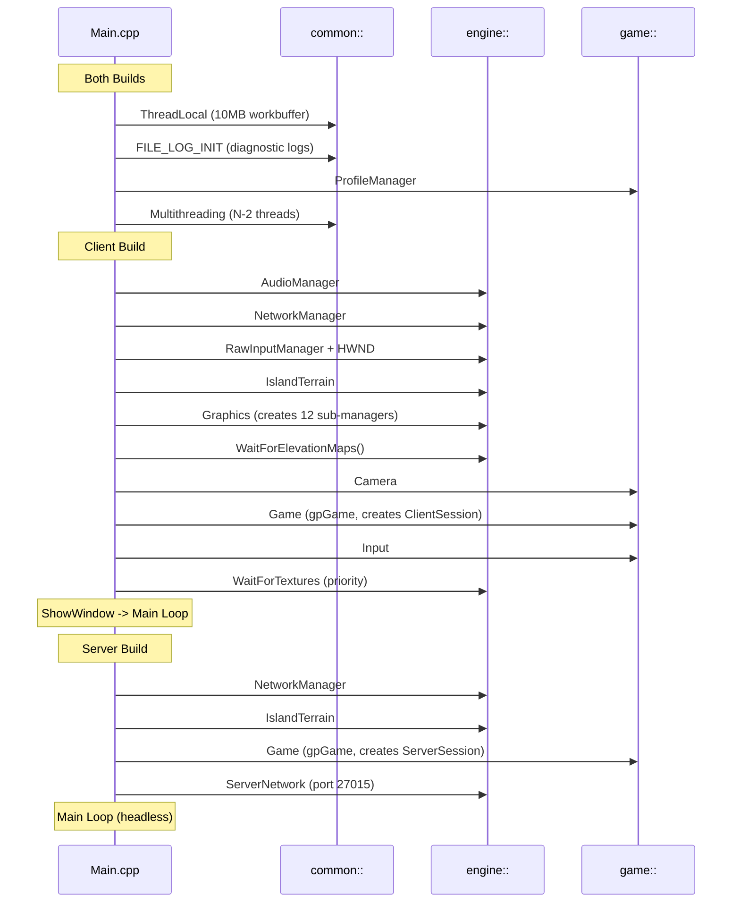

# Architecture: System Overview

> Auto-generated by `/generate-architecture-diagram` from the project root

## Manager Singleton Relationships

Complete `gp*` inventory with ownership edges. Blue = client-only, red = server-only, gray = both builds.

```mermaid
%%{init: {'theme': 'default'}}%%
graph TD
    classDef clientOnly fill:#dbeafe,stroke:#3b82f6
    classDef serverOnly fill:#fee2e2,stroke:#ef4444
    classDef shared fill:#f3f4f6,stroke:#6b7280

    subgraph common_ns ["common::"]
        gpMultithreading["gpMultithreading<br/>Multithreading"]:::shared
        gpThreadLocal["gpThreadLocal<br/>ThreadLocal (thread_local)"]:::shared
    end

    subgraph engine_ns ["engine::"]
        gpFileManager["gpFileManager<br/>FileManager"]:::shared
        gpNetworkManager["gpNetworkManager<br/>NetworkManager"]:::shared
        gpIslandTerrain["gpIslandTerrain<br/>IslandTerrain"]:::shared
        gpClientNetwork["gpClientNetwork<br/>ClientNetwork"]:::clientOnly
        gpServerNetwork["gpServerNetwork<br/>ServerNetwork"]:::serverOnly

        subgraph gfx ["Graphics (client-only)"]
            gpGraphics["gpGraphics<br/>Graphics"]:::clientOnly
            gpInstanceManager["gpInstanceManager"]:::clientOnly
            gpDeviceManager["gpDeviceManager"]:::clientOnly
            gpSwapchainManager["gpSwapchainManager"]:::clientOnly
            gpCommandBufferManager["gpCommandBufferManager"]:::clientOnly
            gpBufferManager["gpBufferManager"]:::clientOnly
            gpTextureManager["gpTextureManager"]:::clientOnly
            gpTextureUploadManager["gpTextureUploadManager"]:::clientOnly
            gpTextManager["gpTextManager"]:::clientOnly
            gpPipelineManager["gpPipelineManager"]:::clientOnly
            gpParticleManager["gpParticleManager"]:::clientOnly
            gpImGuiManager["gpImGuiManager"]:::clientOnly
            gpIslands["gpIslands<br/>Islands"]:::clientOnly
        end

        gpAudioManager["gpAudioManager<br/>AudioManager"]:::clientOnly
        gpRawInputManager["gpRawInputManager<br/>RawInputManager"]:::clientOnly
    end

    subgraph game_ns ["game::"]
        gpGame["gpGame<br/>Game"]:::shared
        gpClientSession["gpClientSession<br/>ClientSession"]:::clientOnly
        gpServerSession["gpServerSession<br/>ServerSession"]:::serverOnly
    end

    gpGraphics -->|owns| gpInstanceManager
    gpGraphics -->|owns| gpDeviceManager
    gpGraphics -->|owns| gpSwapchainManager
    gpGraphics -->|owns| gpCommandBufferManager
    gpGraphics -->|owns| gpBufferManager
    gpGraphics -->|owns| gpTextureManager
    gpGraphics -->|owns| gpTextureUploadManager
    gpGraphics -->|owns| gpTextManager
    gpGraphics -->|owns| gpPipelineManager
    gpGraphics -->|owns| gpParticleManager
    gpGraphics -->|owns| gpImGuiManager
    gpGraphics -->|owns| gpIslands
    gpIslands -->|reads| gpIslandTerrain
    gpGame -->|uses| gpGraphics
    gpGame -->|owns| gpClientSession
    gpGame -->|owns| gpServerSession
    gpClientSession -->|uses| gpClientNetwork
    gpServerSession -->|uses| gpServerNetwork
    gpGame -->|uses| gpFileManager
```

## Initialization Order (Main.cpp)

